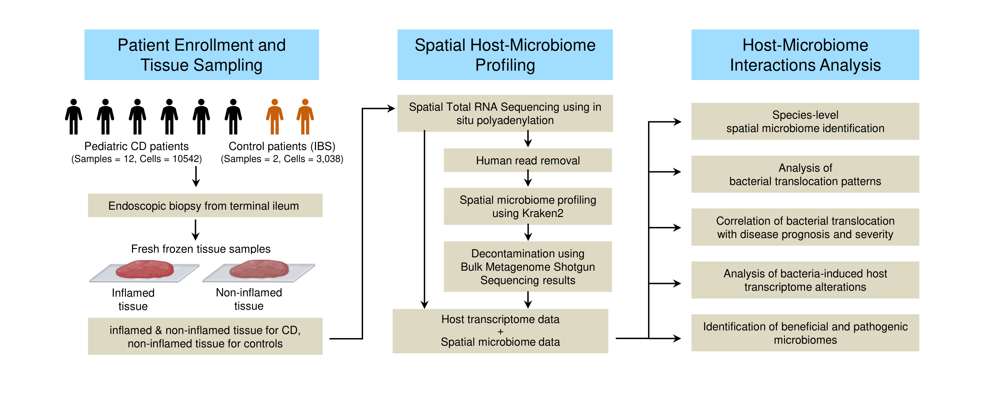

# 24SpatialHostMicrobiomeProfiling

*Figure 1: Overview of the Spatial Host-Microbiome Profiling approach in Crohn's disease tissues.*

## Objective

The objective of this project is to develop and apply a novel spatial host-microbiome profiling approach for simultaneously identifying bacterial species and host transcriptomics at cellular resolution in Crohn's disease tissues.

## Prerequisites

The following tools and versions were used in this study:

* **Python version:** 3.7.4
* **Pandas version:** 1.3.5
* **NumPy version:** 1.21.6
* **Bowtie2 version:** 2.5.1
* **BWA version:** 0.7.17
* **Kraken2 version:** 2.1.1
* **UMI-tools version:** 1.1.1
* **Scanpy version:** 1.9.3

## Databases

The following databases were used in this study:

* **Bowtie2 database:** GRCh38
* **BWA database:** GCA_000001405.28_GRCh38.p13_genomic.fna
* **Kraken2 database:** PlusPF database (version 2022/09/08)

## Project Structure

The project is organized into two main directories, each containing a series of scripts for processing and analyzing spatial transcriptomics and microbiome data:

### src/SpatialMicrobiomeProfiling_SingleFilter

1. `1_HumanReadRemoval_SingleFilterBowtie2.py`: Removes human reads from the raw sequencing data using Bowtie2.
2. `2_ReadSplitting.py`: Splits the non-human reads by cell barcode using UMI-tools.
3. `3_TaxonomicClassification.py`: Performs taxonomic classification of bacterial reads using Kraken2 and Bracken.
4. `4_BrakenDataAggregation.py`: Aggregates the Bracken output data across all samples.

### src/SpatialMicrobiomeProfiling_DoubleFilter

1. `1_HumanReadRemoval_DoubleFilterBowtie2BWA.py`: Removes human reads using a two-step process with BWA and Bowtie2.
2. `2_ReadSplitting.py`: Splits the non-human reads by cell barcode using UMI-tools.
3. `3_TaxonomicClassification.py`: Performs taxonomic classification of bacterial reads using Kraken2 and Bracken.
4. `4_BrakenDataAggregation.py`: Aggregates the Bracken output data across all samples.

## Usage

To run the full pipeline, execute the scripts in each directory in the order they are numbered.

## Data

The data for this project is currently uploaded to the NCBI Sequence Read Archive (SRA) under the accession number 00000000000 (actual accession number to be updated upon receipt).

## Citation

If you use this code or method in your research, please cite our paper:

[Paper citation will be added upon publication]